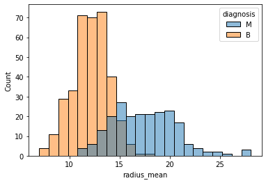

# Analysis of breast cancer data

## Results

The means of radius for B and M were 12.15 and 17.46 respectively. The differences was significant (p value: **1.33e-68**)

## Methods

Mann Whitney U test (two sided) was used to identify the significance of difference of distribution between the Benign and Malignant categories.

## Code availability

[Analysis script](../src/breast_cancer_analysis.py)

## Data availability

[CSV file](../data/external/breast_cancer_wisonsin.csv)

